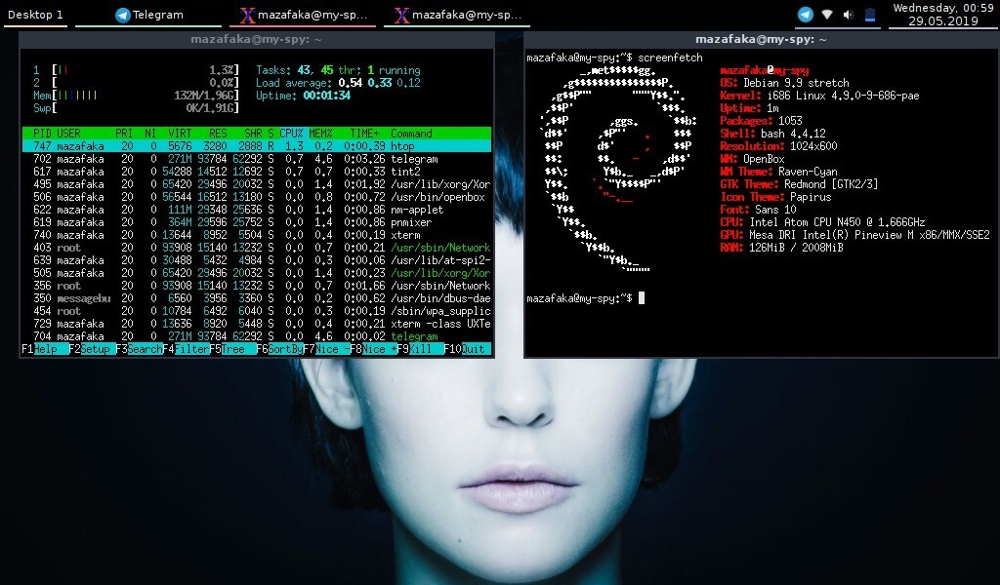

my-openbox-wm
=============

<<<<<<< HEAD
My personal Linux work environment on Openbox WM.

By the way, I have not tested this build at all.

=======
My personal light Linux work environment on Openbox WM.
>>>>>>> 5ee1f29a187a0602e432d25fb070836bca776a8d

License
-------

my-openbox-wm is released under the MIT License.
